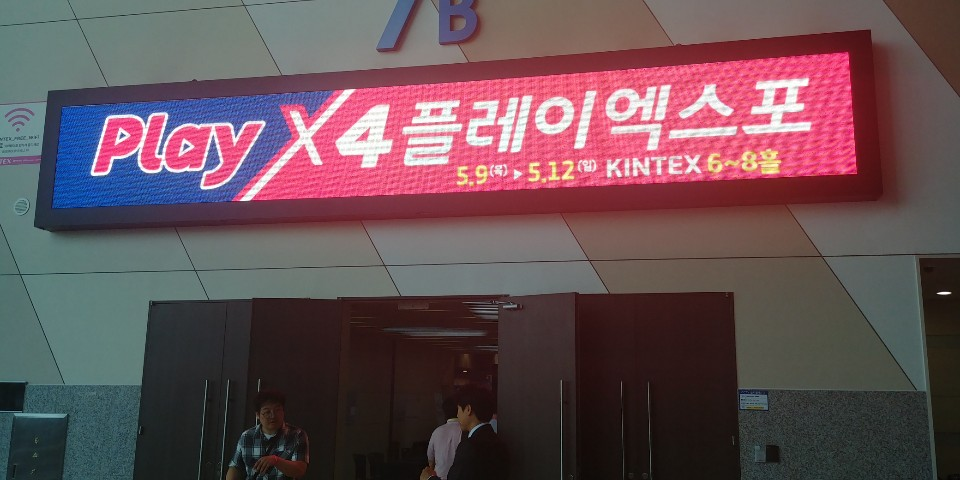
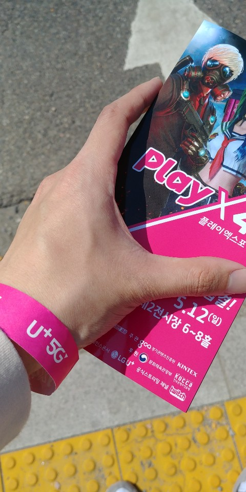
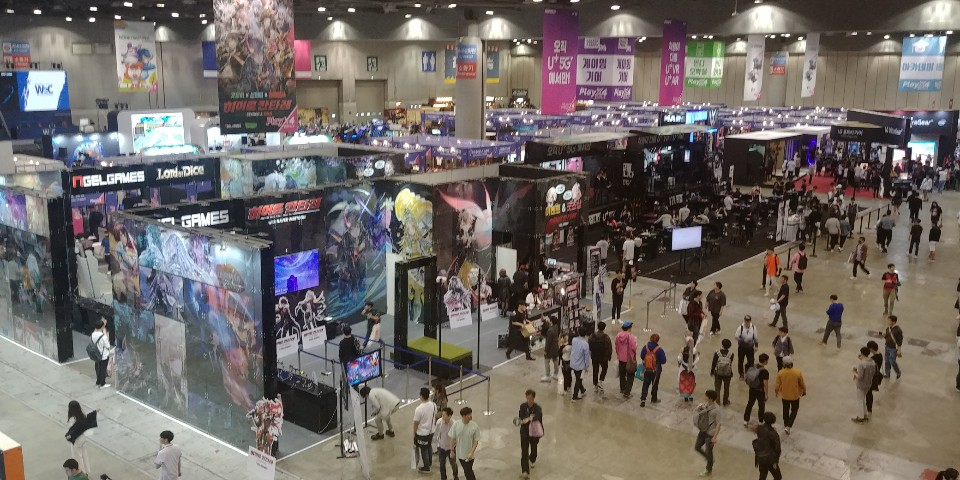

일산 킨텍스에서 개최된 2019플레이엑스포(playX4)를 다녀왔다
이번 플레이엑스포는 5월9일 부터 5월 12일까지 4일간 개최되었다.

산업체특강 수업으로 전시회나 외부행사에 참여하고 레포트를 써야했는데 마침 집에서 가까운 킨텍스에서 플레이엑스포를 한다는 말을 듣고 바로 가게되었다.

킨텍스 2전시장에 플레이엑스포 전시장 입구이다. 나는 첫날에 왔지만 점심시간이 지나고 와서 딱히 대기줄 같은것은 없었다

출입증을 받았다.

입장하면 다음과 같이 많은 부스들이 준비되어 있는 모습을 볼수있다.
앞쪽에는 플레이스테이션 같이 큰 기업의 간판과 부스들이 있었고 몇몇 이벤트가 진행되고 있었다.
여러 게임들을 시연해볼수 있었고 VR게임들도 있었다.

뒤쪽으로는 중소게임기업이나 학교, 학원, 인디게임 개발팀 등의 작은 부스가 있었다.
작은 부스들에는 게임을 직접 만든 개발자들도 있었다.

그 외에도 트위치나 게임경기 같은 다양한 볼거리도 있었다.

B2B쪽 전시관에서는 5월9일 첫날
조화로운 혁신, 왜 블록체인 게임인가?
"카세게 게임" 쓰는 시대에서 버는 시대로의 변화
등의 발표가 있었다.
